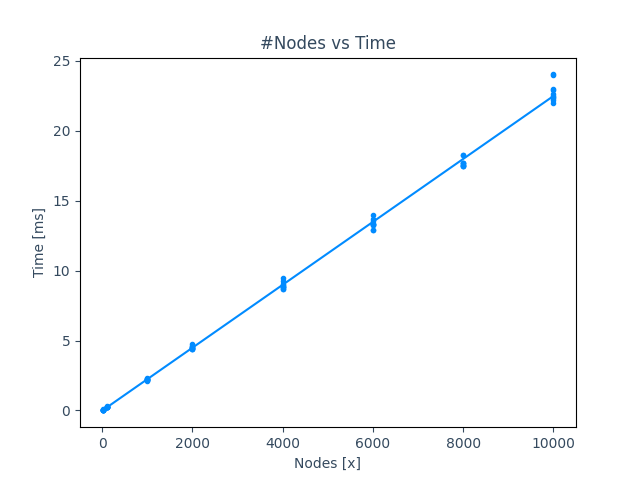
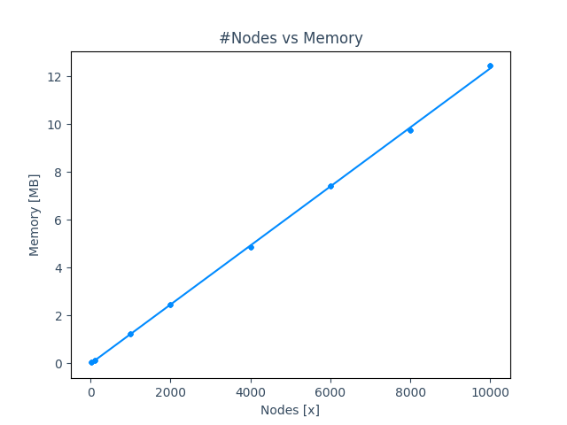
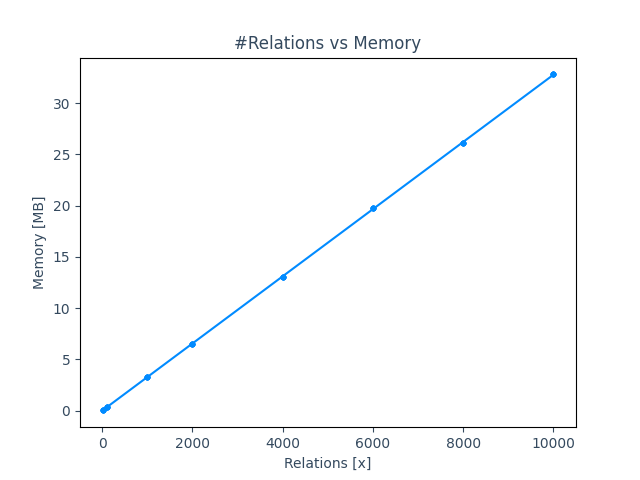

# Benchmark

Benchmarks are created using the [PHPBench framework](https://github.com/phpbench/phpbench).  
Currently the tests are run inside Docker with [Xdebug](https://xdebug.org/) enabled. On bare metal, without Xdebug,
optimized setup etc. the performance should increase quite a bit.

## Node

Time and memory increase linearly with the amount of instances created.  
An average node with two labels, four string properties and an integer id requires ~2kb of memory and is created within
~0.02 ms

## Relation

Time and memory increase linearly with the amount of instances created.  
An average relation with two minimal nodes (one label, one integer id), one type, four string properties and one integer
id requires ~5.5kb of memory and is created within ~0.04ms.

